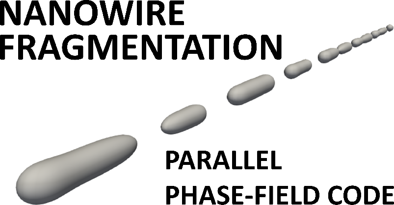

<a name="logo"/>

</img>
</a>

This repository contains simulation code for surface diffusion enhanced nanowire junction break-up. The code is written in CUDA C (GPU accelerated parallel code for Nvidia GPUs). 
https://github.com/abhinavroy1999/nanowire-fragmentation-code/blob/main/background.tif
